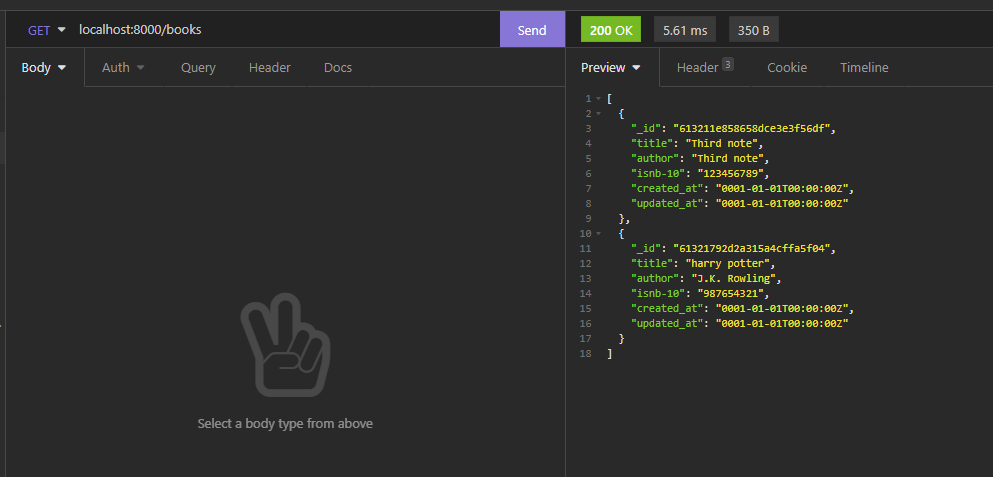
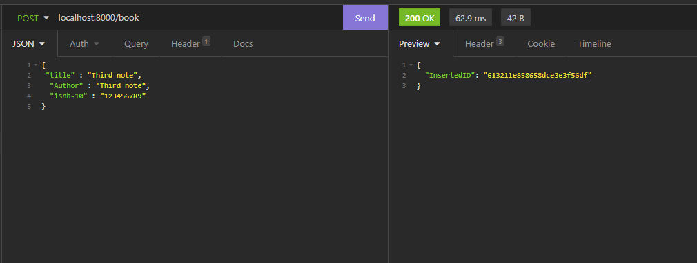

# Uma api de Livraria utilizando Golang, Docker e MongoDB

## Primeiro passos com Docker:

Inicie o docker e utilize o comando no terminal:

```bash
  docker pull mongo
  docker run --name (nome-do-container) -p (porta):27017 -v local:/data/db -d mongo
```

> `--name` você dará o nome do container.

> `-p` a porta a sua escolha em seguida a porta padrão do mongodb. (porta:27017)

>`-v` local onde gostaria que ficasse armazenado o banco de dados do docker. Ex: C:/desktop/arquivoVolume:/data/db (:/data/db comando utilizado para informar ao docker que é para guardar os arquivos do mongodb)

>`-d` para não aplicar em modo desenvolvedor.

>`mongo` imagem do docker. (onde foi criado através do comando docker pull mongo.)

## Criação da Tabela Livraria:

Criei um arquivo chamado: livraria.mongodb - para poder utilizar comandos para criar a Database(Livraria_Moneri) e uma Tabela com nome: "Livro".

# Inicializando:

Abrindo o terminal, utilizando o comando:
```bash
go mod init example.com/greetings
```

para começar a declarar as dependências, utilizando as seguintes bibliotecas:
```bash
go get go.mongodb.org/mongo-driver/mongo
go get github.com/gorilla/mux
```

> `go get go.mongodb.org/mongo-driver/mongo` - me auxliará na conexão com mongodb

> `go get github.com/gorilla/mux` - me auxiliará nas rotas.

# Rota "GET"
Utilizando o método "GET" na segunte rota: localhost:8000/books (Detalhe no nome: "books" pois quero que retorne todos os livros.).

Fiz um pequeno exemplo utilizando o `Insomnia`:




# Rota "POST"
Utilizar methodo "POST" na seguinte rota: localhost:8000/book, e em seguida utilizar o json.

Fiz um pequeno exemplo utilizando o `Insomnia`:

